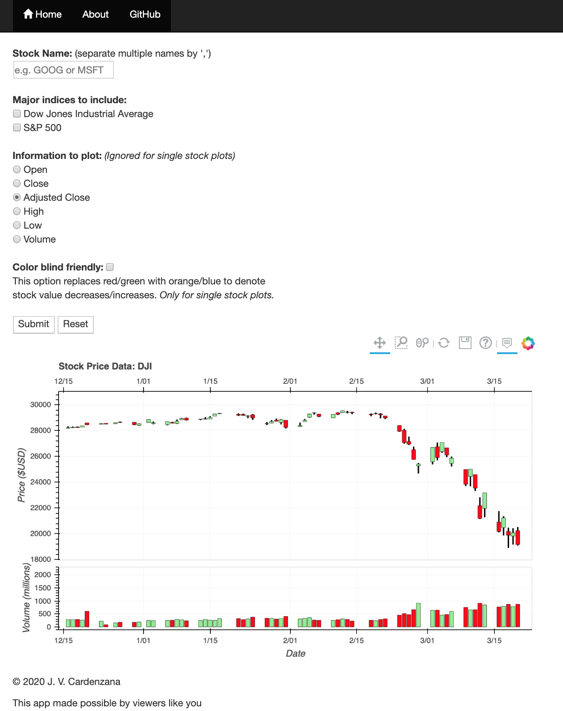

# Historical Stock Data Plotter
This is an implementation of a webapp that displays historical stock data. It is deployed to Heroku and is accessible [here](https://cardenzana-di-milestoneproj.herokuapp.com/).

By default the app focuses on the most recent 100 days, but data for up to 20 years can be viewed by zooming out.

